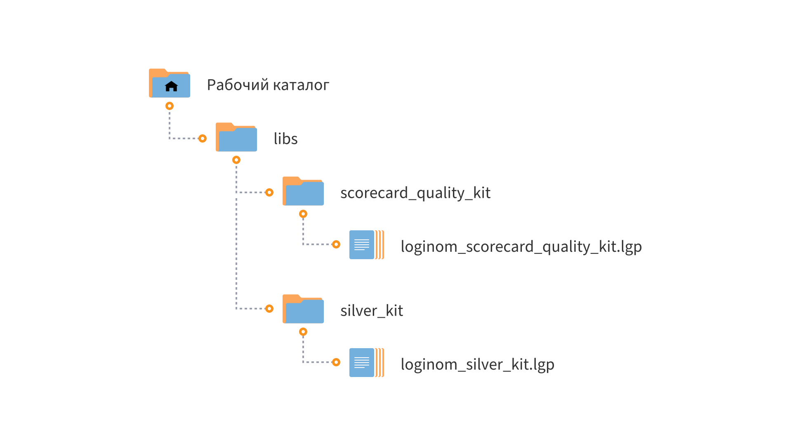

# Loginom Scorecard Quality Kit CE

* Версия 1.0.1
* Проверено: Loginom CE 7.1.5

Библиотека **Loginom Scorecard Quality Kit** позволяет построить KPI панель, включающую все необходимые метрики для оценки качества скоринговой карты. Визуализаторы строятся в формате отчетов в Loginom.

Компоненты находятся в пакете **loginom_scorecard_quality_kit.lgp**.

# Установка и настройка

## Требования

Для работы библиотеки **Loginom Scorecard Quality Kit CE** необходимо:

* Loginom Community Edition. Коммерческие версии Loginom не поддерживаются;
* Библиотека Loginom Silver Kit ([cкачать на GitHub](https://github.com/loginom/loginom-silver-kit)). Версия не ниже 3.0.0.

## Порядок установки

1. Определите рабочий каталог, где будут расположены ваши библиотеки на локальном диске.
2. Создайте в нем подкаталог **libs**.
3. Разместите папку **scorecard_quality_kit** в каталоге **libs**.
4. Убедитесь, что библиотека **Loginom Silver Kit** находится в каталоге **libs** в папке **silver_kit**.

